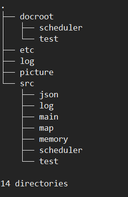
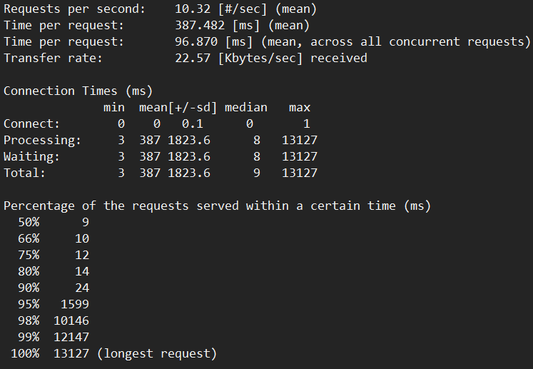
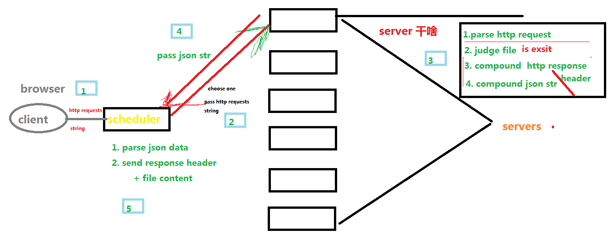
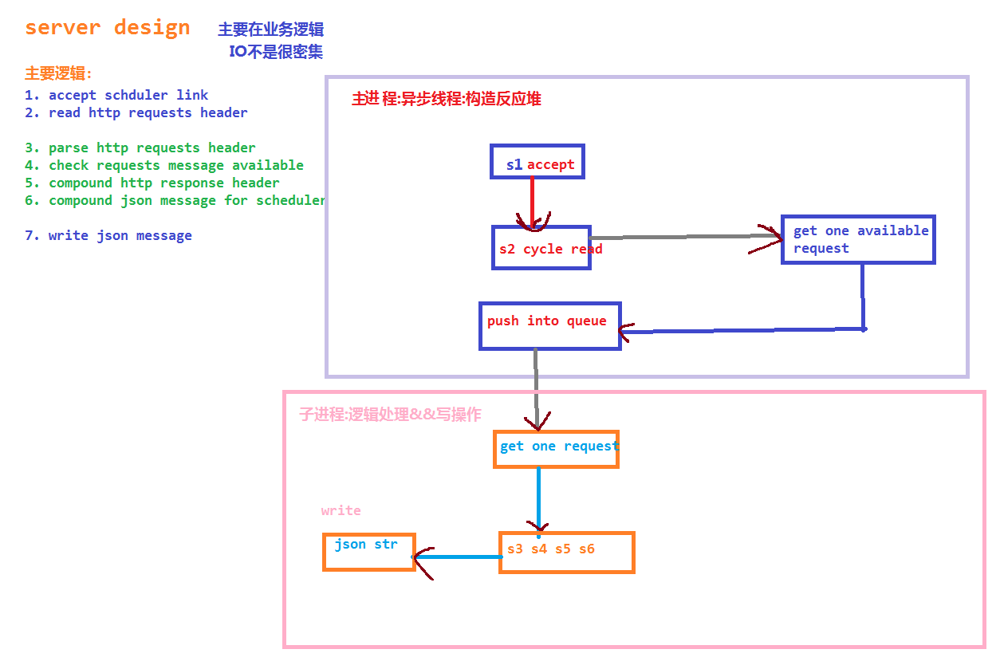
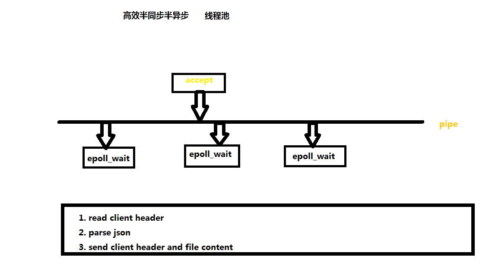

# LonLifeHttpDownloader
## 简介

纯c语言实现的一个简单的支持负载均衡的http文件下载服务器, 性能优良, 服务稳定

## 目录结构介绍



***docroot*** : 用户可以访问的文件的根目录

***etc*** : 配置文件的目录, 配置包括server的信息, 以及scheduler的信息等

***src*** : 源代码

***picture*** : 放置一些相关的图片

***log*** : 日志文件存放的目录


***src/json*** : 实现的json解析和合成

***src/map*** : 实现的数据结构map

***src/memory*** : 实现的内存池

***src/log*** : 实现的打印日志源码

***src/main*** : 服务器端的代码

***src/scheduler*** : 调度器的代码

***src/test*** : 测试相关的代码

## 使用介绍

```shell
1. clone代码到相应的服务器或者调度器
2. 修改etc/server.json 和 etc/scheduler.json文件配置相关信息
3. 执行 sh install.sh && sh run.sh
```

## 性能测试
4个并发数1000个连接循环



## 主要设计

1. scheduler 和 server的分工

2. server采用半同步半反应堆, 多进程模型

3. scheduler采用半同步半异步, 多线程模型, epoll复用


